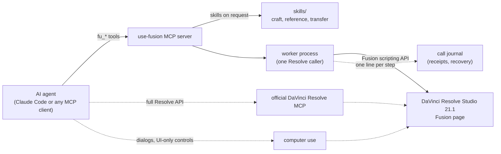

<div align="center">

# open-fusion-mcp

**Agent-built motion design, native in DaVinci Resolve Fusion.**

An MCP server and a set of agent skills that let an AI agent design, build, render and check
real Fusion node graphs: editable titles, kinetic type, UI animation and whole multi-scene films.

[](LICENSE)
[](https://github.com/legionsound/open-fusion-mcp/actions/workflows/ci.yml)


https://github.com/user-attachments/assets/c0c83852-3371-4a8f-9411-3cb59df8130c

*Every frame of this film was built by an agent in Fusion, as one editable comp.*

[Quick start](#quick-start) · [How it works](#how-it-works) · [What's inside](#whats-inside) · [Results](#measured-results) · [Docs](#documentation)

</div>

---

## Why

Fusion is one of the most capable compositing and motion tools there is, and it ships inside DaVinci Resolve.
Agents have had a hard time driving it: one After Effects layer becomes three to ten Fusion nodes, units differ
from input to input, and silent failures are easy. open-fusion-mcp closes that gap with a fast, checked path
into Fusion and the craft knowledge an agent needs to use it well. The connector is a fast path, not a cage:
agents combine it with the official DaVinci Resolve MCP and computer use as [one toolbox](docs/toolbox.md).

## Made with it

The film above is the project's own explainer. It is 59 seconds and 1,779 frames across seven scenes, built as
**one Fusion comp of about 9,000 native nodes**, with 3D cameras, 12-pass depth of field and motion blur. Claude Code agents built every frame through this toolkit from a written brief, and a human editor
directed it through notes on the edit timeline over twelve review rounds. There is no stock footage and no
template: the titles, shapes, cards, cameras and node-graph visuals are Fusion tools the agent wrote.

## Highlights

- **181 checked operations in 36 categories** behind 15 MCP tools (`fu_*`): comps, tools, inputs, keyframes,
  expressions, masks, text, 3D, templates, timelines, renders and Deliver. Every write is read back.
- **One-call scene builder.** Describe layers, type styles, layout, enter/exit moves and a camera; get an
  editable native graph (`scene.build`), then change it by description (`scene.update`). Multi-scene films live
  in one culled comp on a "film ladder".
- **Render-and-look loop.** Frame renders with inline previews, contact sheets, image comparison and a motion
  audit, so the agent checks pixels instead of trusting return values.
- **Build-loop speed.** Disk caches for finished branches (-42 % per render), a one-call graph tidier
  (560 tools in 1.3 s) and a draft/final switch that flips a whole film in one control.
- **Guard rails.** Project allowlist, read-only mode, category allowlist, dry runs and checked connections, with
  clear refusals instead of half-applied edits.
- **Recovery after a timeout.** The worker journals each operation step by step, so the reply to a timeout or
  a dead worker carries a receipt: what finished, what was running and what never started. `batch.recover`
  re-reads the comp, `batch.rollback` undoes the call and verifies the result, `resume` finishes the batch
  without repeating a step, and `atomic: true` makes a batch all or nothing. Fault-injection tests against a fake
  Resolve cover these paths, and a live check in a scratch project confirmed them in Resolve Studio 21.1.
- **Craft skills.** A motion-design procedure and router, a distilled Fusion 21.1 reference and a
  Figma-to-Fusion transfer, written for agents and served by the MCP server itself.

## How it works



The agent loads the `use-fusion` skill first, looks up operations with `fu_catalog` (one operation, a keyword
search or a category), acts with `fu_do` (a batch is one undo step; `atomic: true` makes it all or nothing), and
verifies with `fu_render_frame`. The most-used operations also have their own tools, `fu_scene_build`,
`fu_scene_plan`, `fu_batch` and `fu_contact_sheet`, with schemas generated from the operation definitions, and
every bad-argument reply lists the operation's parameters, so a retry takes one call. If Resolve stops
answering, the reply carries a receipt from the call's journal, and the batch can be rolled back or resumed.
Details: [architecture](docs/architecture.md).

## Quick start

**Requirements:** macOS (tested on Apple Silicon), DaVinci Resolve Studio 21.1 with
*Preferences > System > General > External scripting using = Local*, Python 3.12 and an MCP client.
The free edition of Resolve does not allow external scripting.

```sh
git clone https://github.com/legionsound/open-fusion-mcp.git
cd open-fusion-mcp/connector
python3.12 -m venv .venv && .venv/bin/pip install -r requirements.txt
bin/fusion-connector doctor      # checks Python, the scripting port, Resolve, Studio, skills and data tables
bin/fusion-connector config      # prints the registration command for your MCP client
```

Register the server (Claude Code shown; restart the session afterwards):

```sh
claude mcp add use-fusion --scope user \
  -e FUSION_MCP_PROJECT_ALLOWLIST=Testbed \
  -- /absolute/path/to/open-fusion-mcp/connector/bin/use-fusion-mcp
```

Then generate the Fusion data tables from your own Resolve install
([how](skills/fusion-reference/data/README.md)), open a scratch project named `Testbed`, and ask your agent to
call `fu_version_info` and load the `use-fusion` skill. Full guide: [docs/install.md](docs/install.md).

> [!TIP]
> Keep `FUSION_MCP_PROJECT_ALLOWLIST` set while you learn the tools: every mutating operation refuses
> projects outside the list, and reads still work everywhere.

## What's inside

| Path | What it is |
|---|---|
| [`connector/`](connector) | the `use-fusion` MCP server (Python 3.12), its CLI, offline and live tests, and [`PARITY.md`](connector/PARITY.md) (After Effects connector operations mapped to Fusion) |
| [`skills/`](skills) | agent skills, served by the server and usable directly by your agent |
| [`agents/`](agents) | example Claude Code agent definitions: a builder, a connector engineer and a performance researcher |
| [`docs/`](docs) | install, architecture, toolbox, scene builder, caching, graph layout, results, fonts, maintaining |
| [`scripts/`](scripts) | the maintainer's sync and audit tools |

| Skill | Use it for |
|---|---|
| [`use-fusion`](skills/use-fusion/SKILL.md) | the connector's entry point: working loop, operations, safety, known limits |
| [`fusion-motion-design`](skills/fusion-motion-design/SKILL.md) | the creative procedure and router: titles, kinetic type, UI, glass, depth, transitions, characters, collage, delivery |
| [`fusion-reference`](skills/fusion-reference/SKILL.md) | Fusion 21.1 facts for agents: nodes, inputs and IDs, `.setting` format, measured "realities" of the API |
| [`fusion-figma-transfer`](skills/fusion-figma-transfer/SKILL.md) | Figma frames into editable native Fusion nodes (needs a Figma connection) |

The film mentions six skills. Two VFX skills, `fusion-cleanup` and `fusion-matte-painting`, are being rewritten
and will join in a later release.

## Measured results

Measured on one Mac (Apple Silicon, 32 GB) with Resolve Studio 21.1. The benchmark is a 25-second 3D SaaS ad,
first built in After Effects and then rebuilt cold from the same written spec.

| Build | Agent time | Tool calls |
|---|---|---|
| After Effects (reference) | about 1 h 55 min | about 200 |
| Fusion, first build without the scene builder | about 5.6 h | about 830 |
| **Fusion with the scene builder, one comp** | **1 h 19 min** | **about 156** |

With the scene builder an agent builds a 2,911-tool Fusion film in about the time the After Effects build took,
with a fifth of the first Fusion build's tool calls. More numbers and caveats: [docs/results.md](docs/results.md).

## Documentation

| Guide | |
|---|---|
| [Install](docs/install.md) | requirements, registration, permissions, policy switches, troubleshooting |
| [Architecture](docs/architecture.md) | server, worker, receipts and recovery, operations, skills store, tests |
| [The toolbox](docs/toolbox.md) | when to use this connector, the official Resolve MCP or computer use |
| [Scene builder](docs/scene-builder.md) | the scene description format, films, updates |
| [Caching](docs/caching.md) | disk caches for the build loop, staleness and refresh |
| [Graph layout](docs/graph-layout.md) | the tidier and the house graph style |
| [Results](docs/results.md) | benchmarks, render efficiency, tests |
| [Fonts](docs/fonts.md) | which fonts the examples use |
| [Maintaining](docs/maintaining.md) | how this repository is synced and audited |

## Status

Version 0.2. Tested on macOS (Apple Silicon) with DaVinci Resolve Studio 21.1.0.14, Python 3.12 and Claude Code.
Windows and Linux are untested; the server is plain Python, but the helper that dismisses Resolve's render
dialogs uses AppleScript. See [CHANGELOG.md](CHANGELOG.md) for what is new.

## Contributing

Issues and pull requests are welcome. Start with [CONTRIBUTING.md](CONTRIBUTING.md); run the offline tests
before you open a pull request. Please report security issues privately as described in
[SECURITY.md](SECURITY.md).

## License and credits

MIT, Copyright (c) 2026 Legion Media LLC. See [LICENSE](LICENSE).

This project is the Fusion counterpart of Higgsfield's After Effects connector and skills, and it learned from
several open-source DaVinci Resolve MCP servers; [CREDITS.md](CREDITS.md) lists them with their licenses.
DaVinci Resolve and Fusion are trademarks of Blackmagic Design Pty. Ltd. This project is not affiliated with or
endorsed by Blackmagic Design or Higgsfield.
